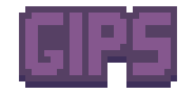

<p align="center">
  
</p>

<p align="center">
A mid-level Game Engine for TypeScript
</p>

<p align="center">
  <a href="https://www.typescriptlang.org/" rel="TypeScript"></a>
  <a href="https://github.com/BumpyBill/gips/tags" rel="Tags"></a>
  <a href="https://github.com/BumpyBill/gips/stargazers" rel="Stargazers"></a>

</p>

- [Install](#install)
- [Technologies](#technologies)
- [Contributing](#contributing)
- [License](#license)

## Install

```sh
$ git clone https://github.com/BumpyBill/gips --branch 0.0.1
```

## Technologies

- [WebGL](https://get.webgl.org/)
- [TypeScript](https://www.typescriptlang.org/)

## Contributing

Feedback and PRs are welcome!

## License

This project is licensed under the MIT License. See [LICENSE](LICENSE) for details.
